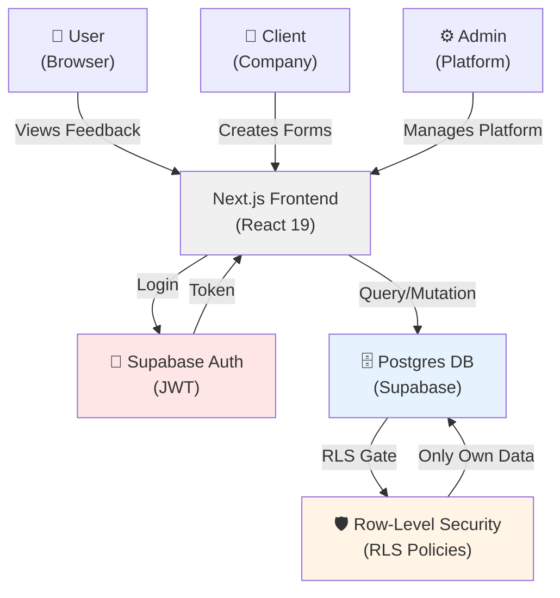
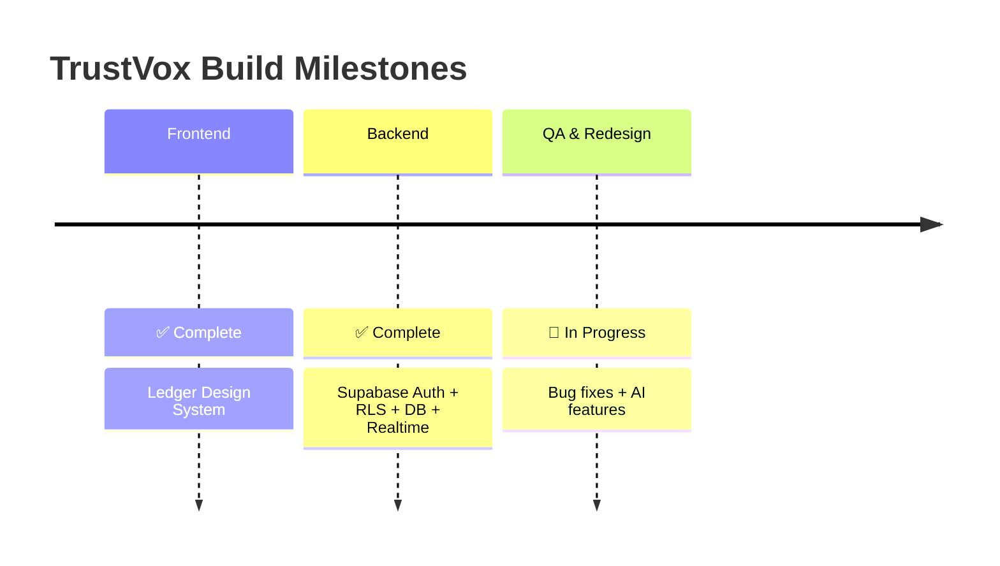
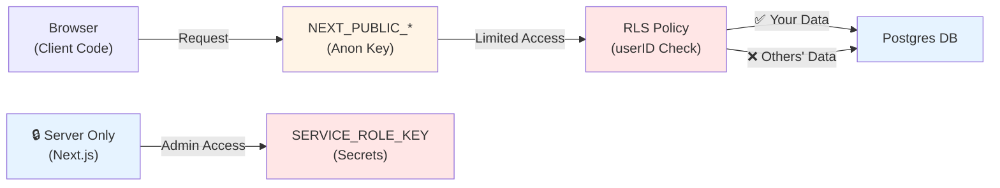

# TrustVox — Feedback & Rewards Platform

A portfolio-grade feedback platform where **users earn TVX tokens (in-app reward points) for accepted feedback and redeem them for coupons**. Built with Next.js, React, and Supabase — designed for three user roles: **users**, **clients** (companies), and **admins**.

> **TVX is in-app reward points, not crypto/web3.** Just a points ledger that tracks balance and redemptions.

---

## 🎯 Quick Start

```bash
# Clone and install
git clone <repo-url>
cd trustvoxplatformver5
pnpm install

# Run dev server
pnpm dev        # http://localhost:3000

# Other commands
pnpm build      # Production build
pnpm start      # Run prod build (use: pnpm start -p 3000)
pnpm lint       # Check TypeScript & ESLint (strict mode, 0 errors)
```

---

## 🏗️ System Architecture

### User & Data Flow



### Build Progress



> Deploy (Vercel/Supabase production) was considered and **scrapped** — TrustVox stays a local, non-deployed portfolio piece.

---

## 📂 Project Structure

```
trustvoxplatformver5/
│
├─ app/                          # Next.js App Router routes
│  ├─ user/                       # User portal (dashboard, wallet, store, feedback)
│  ├─ client/                     # Client portal (forms, analytics, approvals)
│  ├─ admin/                      # Admin portal (approvals, user management)
│  └─ (auth pages)                # /signin, /login, /signup, /client-login, /client-signup, /admin-login
│
├─ components/                    # React components
│  ├─ user/                       # User-specific UI (navbar, dashboard sections)
│  ├─ client/                     # Client-specific UI
│  ├─ admin/                      # Admin-specific UI
│  ├─ auth/                       # Shared auth shell (all login/signup pages)
│  ├─ modals/                     # Cross-role modals
│  └─ ui/                         # shadcn/Radix primitives
│
├─ lib/                          # Domain logic (state + storage)
│  ├─ feedback-store.ts          # Feedback forms & responses
│  ├─ tvx-wallet.ts              # TVX balance & transactions
│  ├─ feedback-quota.ts          # Daily submission limits
│  ├─ user-notifications.ts      # Notification feed
│  └─ approved-company-store.ts  # Company directory
│
├─ supabase/                     # Database & backend
│  ├─ migrations/                # Schema + RLS policies (git-tracked)
│  └─ seed.sql                   # Seed data (honest-by-construction)
│
├─ docs/                         # 📌 INTERNAL DOCS (not git-tracked)
│  ├─ frontend/                  # UI rebuild status + architecture
│  ├─ backend/                   # DB rebuild status + architecture
│  └─ README.md                  # Docs hub
│
├─ public/                       # Static assets (images, fonts)
├─ .env.example                  # Environment variables template
└─ next.config.mjs               # Next.js config (strict TS + ESLint)
```

---

## 🔐 Security & Data Access

### How Data Privacy Works



### Key Points

- **Public Vars** (`NEXT_PUBLIC_SUPABASE_URL`, `NEXT_PUBLIC_SUPABASE_ANON_KEY`) → Safe to expose; RLS gates what you can read
- **Server Secrets** (`SUPABASE_SERVICE_ROLE_KEY`) → Stays in `.env.local`; never sent to browser
- **RLS Policies** → Every table enforces `WHERE user_id = auth.uid()` so users only see their own data
- **Server-Side Validation** → All writes go through Next.js server actions + `zod` schemas; no self-minting rewards

---

## 📋 Routes & Pages

### Authentication (All Roles)
- `/signin` — Role picker landing page (choose User or Client, links to their own login/signup doors)
- `/login` — User sign-in door
- `/signup` — User self-serve registration
- `/client-login` — Client sign-in door
- `/client-signup` — Client self-serve registration
- `/admin-login` — Admin auth (sign-in only; admins provisioned by hand, no self-serve signup)

### User Portal
- `/user/dashboard` — Main hub (home · browse feedback · history · profile)
- `/user/feedback/[id]` — Single feedback detail + submission
- `/user/wallet` — TVX balance & transaction history
- `/user/store` — Redeem TVX for coupons

### Client Portal
- `/client/dashboard` — Home hub
- `/client/forms` — Manage feedback forms
- `/client/create-feedback` — Launch new feedback request (AI question-quality critique inline)
- `/client/analytics` — Response stats & insights (AI-generated response summaries)
- `/client/history` — Submitted responses
- `/client/profile` — Account settings

### Admin Portal
- `/admin` — Home hub (Command Center, realtime)
- `/admin/approvals` — Review & approve feedback
- `/admin/approved-companies` — Company directory
- `/admin/user-management` — User controls, block/unblock, lockout

### Public
- `/` — Landing page
- `/contact` — Contact form
- `/legal` — Legal / policy pages

---

## 🛠️ Tech Stack

| Layer | Technology |
| --- | --- |
| **Frontend** | Next.js 15 (App Router), React 19, TypeScript (strict) |
| **Styling** | Tailwind CSS, shadcn/ui, Radix UI, lucide-react |
| **Forms** | react-hook-form, zod validation |
| **State** | Domain stores (`lib/*.ts`) + Supabase Realtime |
| **AI** | Groq SDK — question-quality critique, question generation, response summaries |
| **UI Charts** | Recharts (analytics), html2canvas (PDF export) |
| **Notifications** | sonner toasts |
| **Backend** | Supabase (Postgres + Auth + RLS + Realtime) |
| **Package Manager** | pnpm |

---

## 📚 Design System: "Ledger"

Dark, quiet-fintech aesthetic with a single gold accent and mint for positive states. No gradients, no gimmicks.

- **Primary accent:** Gold (`#d4a574`)
- **Positive state:** Mint (`#7dd3c0`)
- **Backgrounds:** Deep charcoal (`#0f0f0f`) with subtle layers
- **Borders:** Minimal, understated

---

## 🔑 Environment Variables

Create `.env.local` in the project root:

```env
# Public (safe to expose)
NEXT_PUBLIC_SUPABASE_URL=https://your-project.supabase.co
NEXT_PUBLIC_SUPABASE_ANON_KEY=eyJhbGc...

# Server-only (never sent to browser)
SUPABASE_SERVICE_ROLE_KEY=eyJhbGc...
GROQ_API_KEY=gsk_...
```

Use `.env.example` as a template. **Never commit `.env.local`** — it contains secrets.

---

## 🚀 Getting Started with Development

```bash
# 1. Install dependencies
pnpm install

# 2. Create .env.local with your Supabase keys
cp .env.example .env.local
# Then edit .env.local and add your actual keys

# 3. Run the dev server
pnpm dev

# 4. Open http://localhost:3000 in your browser
```

### Development Checklist
- Code changes go in `app/`, `components/`, `lib/`, `supabase/migrations/`
- Test locally with `pnpm dev`
- Lint & type-check: `pnpm lint` (strict mode, zero errors)
- Build for production: `pnpm build`

---

## ✨ Current Status

- **Frontend:** ✅ Complete — Ledger design system rebuilt
- **Backend:** ✅ Complete — Supabase auth + RLS + database + Realtime, security-hardened
- **QA & Redesign:** 🔄 In Progress — per-page bug fixes + real AI features (Groq)
- **Deploy:** ❌ Scrapped — stays a local, non-deployed portfolio piece

---

## 📝 Key Architecture Notes

- **TypeScript strict mode** — Zero tolerance for new errors (enforced in build)
- **Domain logic** — Lives in `lib/` as reusable, storage-agnostic modules
- **Data isolation** — RLS policies ensure users see only their own data and feedback
- **Honest seed data** — No fabricated analytics or stats in seed data
- **Server-side validation** — All writes validated with `zod` schemas; no client-side trust
